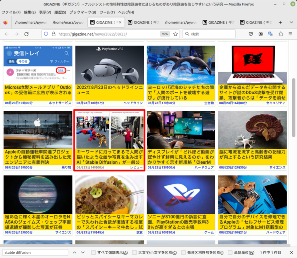

# GigazineTimeleapScript （ギガジンタイムリープスクリプト）

## 概要
GigazineTimeleapScript（gigazt.py）は、Gigazineのニュースアーカイブをあたかも【過去のその日時に戻ったか】のように閲覧するためのPythonスクリプトです。ユーザーが指定した年月のGigazineの記事への日別のリンクを集めたHTMLファイルを生成します。このスクリプトを使うことで、過去に遡って特定の月に公開された記事を簡単に閲覧できます。

<br>
*Stable Diffusionが報じられ始めた頃*
<br><br>
<br>
*東日本大震災が起きた2011年3月11日のニュース*

## 主な機能
- **年月指定機能**: ユーザーは特定の年月を指定することで、その月のすべてのGigazine記事へのリンクを含むHTMLファイルを生成します。
- **日別のリンク**: スクリプトによって生成されたHTMLファイルは、日別のリンクを持ちます。

## 使い方
例えば、Stable DiffusionがGitHubにリポジトリ登録されたのが2022年8月10日です。このテクノロジーが広く報じられ始められたころのニュースを調査したい場合、以下のようにスクリプトを実行します。

```
$ python3 gigazt.py
Enter the year: 2022
Enter the month: 8
Enter the filename (e.g., links.html): links202208.html
```

入力を促されるので、年、月、そして出力ファイル名を指定します。
すると、2022年8月に投稿されたGigazineの記事へのリンクが links202208.html というファイルで得られます。<br>
あとはこのファイルをブラウザへドロップしてください。

## セットアップ
1. Python 3.x がインストールされた環境が必要です。
2. スクリプト`gigazt.py` をダウンロードし、コマンドラインから実行します。

## ライセンス
このプロジェクトは [MITライセンス](LICENSE.txt) の下で公開されています。

