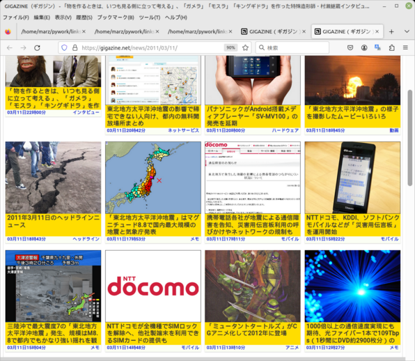

# GigazineTimeleapScript

## 概要
GigazineTimeleapScript（gigazt.py）は、Gigazineのニュースアーカイブをあたかも過去のその日時に戻ったかのように閲覧するためのPythonスクリプトです。ユーザーが指定した年月のGigazineの記事への日別のリンクを集めたHTMLファイルを生成します。このスクリプトを使うことで、過去に遡って特定の月に公開された記事を簡単に閲覧できます。

 
*Stable Diffusionが公開された頃のニュース*
  
 
*東日本大震災が起きた2011年3月11日のニュース*

## 主な機能
- **年月指定機能**: ユーザーは特定の年月を指定することで、その月のすべてのGigazine記事へのリンクを含むHTMLファイルを生成します。
- **日別のリンク**: スクリプトによって生成されたHTMLファイルは、日別のリンクを持ちます。

## 使用例
例えば、Stable DiffusionがGitHubに公開された2022年8月10日の周辺のニュースを調査したい場合、ユーザーはスクリプトを以下のように実行します。

'''
Enter the year: 2022
Enter the month: 8
Enter the filename (e.g., links.html): links.html
'''

すると、2022年8月に投稿されたGigazineの記事へのリンクが得られます。

## セットアップ
1. Python 3.x がインストールされた環境が必要です。
2. `gigazt.py` をダウンロードし、コマンドラインから直接実行可能です。

## ライセンス
このプロジェクトは [MITライセンス](LICENSE) の下で公開されています。

